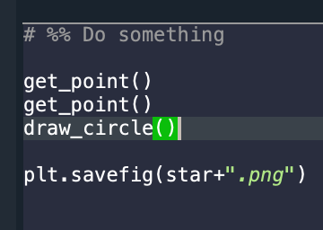
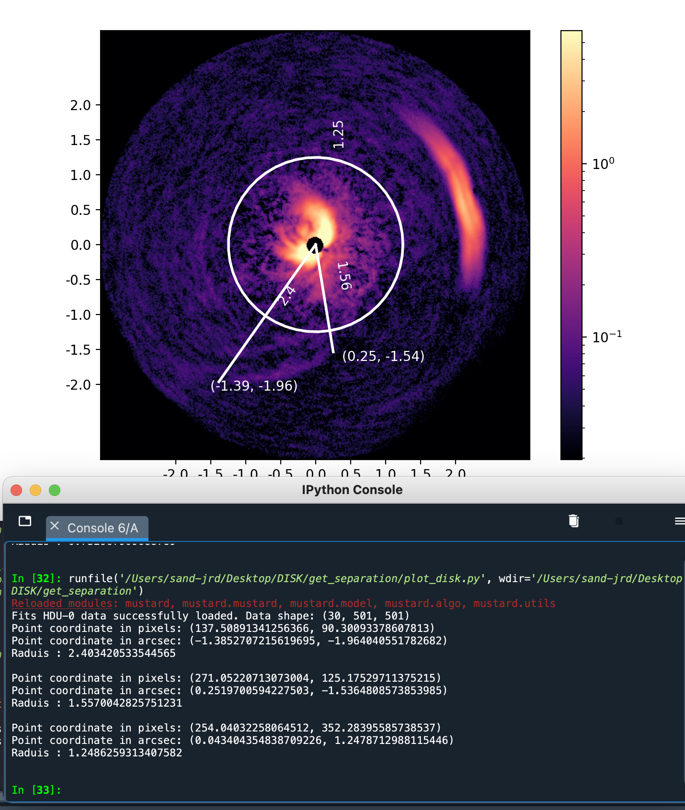

# get_separation
Small tool to get coordinates by clicking on the image

⚠ This is not a well-finished tool at all ⚠

The list of packages version I currently use is in requirement.txt

## How to use

1. Set the parameters
2. Modify the few last lines of the file to define what you want to draw on the figure. Example below ↓

3. Then run the file. Click the coordinate(s) with your mouse. ⚠ Don't click too fast.
4. It will draw things on the figure and print coordinate(s) in the console. Example below ↓

